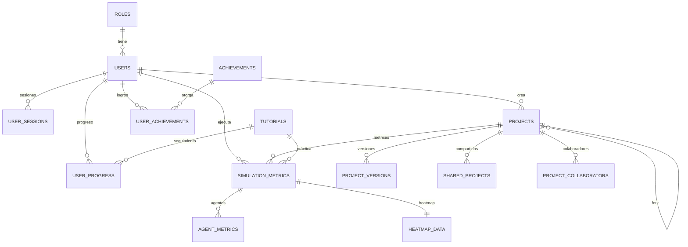

# Esquema de Base de Datos

## Plataforma Educativa Multi-Agente

**Base de Datos:** PostgreSQL  
**ORM:** SQLAlchemy 2.0  
**Total de Tablas:** 14  
**Versión:** 1.0.0

---

## Resumen de Módulos

| Módulo                      | Tablas | Propósito                                           |
| --------------------------- | ------ | --------------------------------------------------- |
| **Módulo 1: Autenticación** | 3      | Gestión de usuarios, roles y sesiones               |
| **Módulo 2: Proyectos**     | 4      | Creación, versionado y compartición de simulaciones |
| **Módulo 3: Tutoriales**    | 4      | Sistema educativo con progreso y logros             |
| **Módulo 4: Métricas**      | 3      | Análisis de rendimiento y visualización             |

---

## Módulo 1: Autenticación

### Tabla: roles

**Almacena:** Roles del sistema con sus permisos (estudiante, profesor, administrador).

| Campo       | Tipo        | Descripción                              |
| ----------- | ----------- | ---------------------------------------- |
| id          | SERIAL      | Identificador del rol                    |
| name        | VARCHAR(50) | Nombre del rol (student, teacher, admin) |
| description | TEXT        | Descripción del rol                      |
| permissions | JSONB       | Permisos en formato JSON                 |
| created_at  | TIMESTAMP   | Fecha de creación                        |
| updated_at  | TIMESTAMP   | Última actualización                     |

**Relaciones:** Un rol tiene muchos usuarios.

---

### Tabla: users

**Almacena:** Usuarios registrados con sus credenciales, perfil y estadísticas.

| Campo                | Tipo         | Descripción                     |
| -------------------- | ------------ | ------------------------------- |
| id                   | UUID         | Identificador único del usuario |
| username             | VARCHAR(50)  | Nombre de usuario único         |
| email                | VARCHAR(255) | Correo electrónico único        |
| hashed_password      | VARCHAR(255) | Contraseña encriptada (bcrypt)  |
| full_name            | VARCHAR(100) | Nombre completo                 |
| avatar_url           | VARCHAR(500) | URL del avatar                  |
| bio                  | TEXT         | Biografía del usuario           |
| role_id              | INTEGER      | Rol asignado (FK → roles)       |
| is_active            | BOOLEAN      | Cuenta activa                   |
| is_verified          | BOOLEAN      | Email verificado                |
| email_verified_at    | TIMESTAMP    | Fecha de verificación           |
| total_projects       | INTEGER      | Contador de proyectos           |
| total_likes_received | INTEGER      | Total de likes recibidos        |
| total_followers      | INTEGER      | Total de seguidores             |
| created_at           | TIMESTAMP    | Fecha de registro               |
| updated_at           | TIMESTAMP    | Última actualización            |
| last_login_at        | TIMESTAMP    | Último inicio de sesión         |

**Relaciones:** Tiene muchas sesiones, proyectos, progresos y logros.

---

### Tabla: user_sessions

**Almacena:** Sesiones activas con tokens JWT para gestión de autenticación.

| Campo            | Tipo         | Descripción                      |
| ---------------- | ------------ | -------------------------------- |
| id               | UUID         | Identificador de la sesión       |
| user_id          | UUID         | Usuario propietario (FK → users) |
| token_jti        | VARCHAR(255) | JWT ID para revocación           |
| refresh_token    | VARCHAR(500) | Token de renovación              |
| ip_address       | VARCHAR(45)  | Dirección IP del cliente         |
| user_agent       | TEXT         | Navegador/dispositivo            |
| is_active        | BOOLEAN      | Sesión activa                    |
| expires_at       | TIMESTAMP    | Fecha de expiración              |
| created_at       | TIMESTAMP    | Fecha de creación                |
| last_activity_at | TIMESTAMP    | Última actividad                 |

**Relaciones:** Pertenece a un usuario.

---

## Módulo 2: Proyectos

### Tabla: projects

**Almacena:** Proyectos de simulación creados por usuarios, incluyendo código, configuración del grid y estado del mundo.

| Campo             | Tipo         | Descripción                                        |
| ----------------- | ------------ | -------------------------------------------------- |
| id                | UUID         | Identificador del proyecto                         |
| user_id           | UUID         | Propietario (FK → users)                           |
| title             | VARCHAR(200) | Título del proyecto                                |
| description       | TEXT         | Descripción en Markdown                            |
| thumbnail_url     | VARCHAR(500) | Miniatura del proyecto                             |
| is_public         | BOOLEAN      | Visible en galería pública                         |
| is_template       | BOOLEAN      | Proyecto plantilla oficial                         |
| fork_from_id      | UUID         | Proyecto del que se hizo fork (FK → projects)      |
| grid_width        | INTEGER      | Ancho del grid (5-50)                              |
| grid_height       | INTEGER      | Alto del grid (5-50)                               |
| cell_size         | INTEGER      | Tamaño de celda en píxeles (10-50)                 |
| user_code         | TEXT         | Código Python del usuario                          |
| code_language     | VARCHAR(20)  | Lenguaje de programación                           |
| world_state       | JSONB        | Estado del mundo (agentes, comida, obstáculos)     |
| simulation_config | JSONB        | Configuración de la simulación                     |
| difficulty        | VARCHAR(20)  | Dificultad (beginner/intermediate/advanced/expert) |
| views_count       | INTEGER      | Contador de vistas                                 |
| likes_count       | INTEGER      | Contador de likes                                  |
| forks_count       | INTEGER      | Contador de forks                                  |
| comments_count    | INTEGER      | Contador de comentarios                            |
| version_count     | INTEGER      | Número de versiones guardadas                      |
| last_opened_at    | TIMESTAMP    | Última vez abierto                                 |
| created_at        | TIMESTAMP    | Fecha de creación                                  |
| updated_at        | TIMESTAMP    | Última actualización                               |
| deleted_at        | TIMESTAMP    | Fecha de eliminación (soft delete)                 |

**Relaciones:** Pertenece a un usuario, tiene versiones, enlaces compartidos, colaboradores y métricas.

---

### Tabla: project_versions

**Almacena:** Historial de versiones de cada proyecto (como Git), permitiendo rollback y seguimiento de cambios.

| Campo             | Tipo         | Descripción                              |
| ----------------- | ------------ | ---------------------------------------- |
| id                | UUID         | Identificador de la versión              |
| project_id        | UUID         | Proyecto (FK → projects)                 |
| version_number    | INTEGER      | Número de versión secuencial             |
| commit_message    | VARCHAR(500) | Mensaje del commit                       |
| user_code         | TEXT         | Snapshot del código                      |
| world_state       | JSONB        | Snapshot del estado del mundo            |
| simulation_config | JSONB        | Snapshot de la configuración             |
| created_by        | UUID         | Usuario que creó la versión (FK → users) |
| created_at        | TIMESTAMP    | Fecha de creación                        |
| file_size_bytes   | INTEGER      | Tamaño del snapshot                      |

**Relaciones:** Pertenece a un proyecto.

---

### Tabla: shared_projects

**Almacena:** Enlaces únicos para compartir proyectos públicamente con control de acceso.

| Campo            | Tipo         | Descripción                         |
| ---------------- | ------------ | ----------------------------------- |
| id               | UUID         | Identificador del enlace            |
| project_id       | UUID         | Proyecto compartido (FK → projects) |
| share_token      | VARCHAR(64)  | Token único para URL                |
| share_type       | VARCHAR(20)  | Tipo de acceso (view/edit/embed)    |
| password_hash    | VARCHAR(255) | Contraseña opcional                 |
| expires_at       | TIMESTAMP    | Fecha de expiración                 |
| max_views        | INTEGER      | Límite de visualizaciones           |
| current_views    | INTEGER      | Visualizaciones actuales            |
| is_active        | BOOLEAN      | Enlace activo                       |
| created_at       | TIMESTAMP    | Fecha de creación                   |
| last_accessed_at | TIMESTAMP    | Último acceso                       |

**Relaciones:** Pertenece a un proyecto.

---

### Tabla: project_collaborators

**Almacena:** Usuarios invitados a colaborar en proyectos con diferentes niveles de permisos.

| Campo            | Tipo        | Descripción                            |
| ---------------- | ----------- | -------------------------------------- |
| id               | SERIAL      | Identificador                          |
| project_id       | UUID        | Proyecto (FK → projects)               |
| user_id          | UUID        | Colaborador (FK → users)               |
| permission_level | VARCHAR(20) | Nivel de permiso (viewer/editor/admin) |
| invited_by       | UUID        | Quien invitó (FK → users)              |
| invited_at       | TIMESTAMP   | Fecha de invitación                    |
| accepted_at      | TIMESTAMP   | Fecha de aceptación                    |
| status           | VARCHAR(20) | Estado (pending/active/revoked)        |

**Relaciones:** Pertenece a un proyecto y a un usuario.

---

## Módulo 3: Tutoriales

### Tabla: tutorials

**Almacena:** Lecciones interactivas del sistema educativo con teoría, código inicial y criterios de éxito.

| Campo                  | Tipo          | Descripción                                 |
| ---------------------- | ------------- | ------------------------------------------- |
| id                     | SERIAL        | Identificador del tutorial                  |
| level                  | INTEGER       | Nivel del tutorial (1-20)                   |
| title                  | VARCHAR(200)  | Título del tutorial                         |
| slug                   | VARCHAR(100)  | Identificador para URL                      |
| description            | TEXT          | Descripción general                         |
| theory_content         | TEXT          | Contenido teórico en Markdown               |
| diagram_url            | VARCHAR(500)  | URL del diagrama explicativo                |
| learning_objectives    | TEXT[]        | Array de objetivos de aprendizaje           |
| starter_code           | TEXT          | Código inicial del tutorial                 |
| initial_world_state    | JSONB         | Estado inicial del mundo                    |
| grid_config            | JSONB         | Configuración del grid                      |
| success_criteria       | JSONB         | Criterios para completar el tutorial        |
| difficulty             | VARCHAR(20)   | Dificultad (beginner/intermediate/advanced) |
| estimated_time_minutes | INTEGER       | Tiempo estimado de completado               |
| prerequisites          | INTEGER[]     | Array de tutoriales previos requeridos      |
| tags                   | VARCHAR(50)[] | Etiquetas de clasificación                  |
| is_active              | BOOLEAN       | Tutorial activo                             |
| order_index            | INTEGER       | Orden de visualización                      |
| created_at             | TIMESTAMP     | Fecha de creación                           |
| updated_at             | TIMESTAMP     | Última actualización                        |

**Relaciones:** Tiene muchos registros de progreso de usuarios.

---

### Tabla: user_progress

**Almacena:** Progreso individual de cada usuario en cada tutorial, incluyendo intentos y código.

| Campo              | Tipo        | Descripción                                        |
| ------------------ | ----------- | -------------------------------------------------- |
| id                 | SERIAL      | Identificador del progreso                         |
| user_id            | UUID        | Usuario (FK → users)                               |
| tutorial_id        | INTEGER     | Tutorial (FK → tutorials)                          |
| status             | VARCHAR(20) | Estado (not_started/in_progress/completed/perfect) |
| current_code       | TEXT        | Código actual (auto-guardado)                      |
| best_attempt_code  | TEXT        | Mejor intento guardado                             |
| attempts_count     | INTEGER     | Número de intentos                                 |
| time_spent_seconds | INTEGER     | Tiempo total dedicado                              |
| lines_of_code      | INTEGER     | Líneas de código escritas                          |
| steps_to_solution  | INTEGER     | Pasos del agente en mejor solución                 |
| efficiency_score   | INTEGER     | Puntuación de eficiencia (0-100)                   |
| criteria_met       | JSONB       | Criterios cumplidos                                |
| started_at         | TIMESTAMP   | Primer intento                                     |
| completed_at       | TIMESTAMP   | Fecha de completado                                |
| last_attempt_at    | TIMESTAMP   | Último intento                                     |
| updated_at         | TIMESTAMP   | Última actualización                               |

**Relaciones:** Pertenece a un usuario y a un tutorial.

---

### Tabla: achievements

**Almacena:** Definición de logros desbloqueables del sistema de gamificación.

| Campo           | Tipo         | Descripción                         |
| --------------- | ------------ | ----------------------------------- |
| id              | SERIAL       | Identificador del logro             |
| name            | VARCHAR(100) | Nombre del logro                    |
| slug            | VARCHAR(100) | Identificador para URL              |
| description     | TEXT         | Descripción del logro               |
| icon_url        | VARCHAR(500) | URL del ícono                       |
| unlock_criteria | JSONB        | Criterios para desbloquear          |
| rarity          | VARCHAR(20)  | Rareza (common/rare/epic/legendary) |
| points          | INTEGER      | Puntos otorgados                    |
| is_active       | BOOLEAN      | Logro activo                        |
| created_at      | TIMESTAMP    | Fecha de creación                   |

**Relaciones:** Tiene muchos desbloqueos de usuarios.

---

### Tabla: user_achievements

**Almacena:** Logros desbloqueados por cada usuario con fecha y notificación.

| Campo             | Tipo      | Descripción                               |
| ----------------- | --------- | ----------------------------------------- |
| id                | SERIAL    | Identificador del desbloqueo              |
| user_id           | UUID      | Usuario (FK → users)                      |
| achievement_id    | INTEGER   | Logro (FK → achievements)                 |
| unlocked_at       | TIMESTAMP | Fecha de desbloqueo                       |
| notification_seen | BOOLEAN   | Notificación vista                        |
| progress_data     | JSONB     | Datos de progreso para logros progresivos |

**Relaciones:** Pertenece a un usuario y a un logro.

---

## Módulo 4: Métricas

### Tabla: simulation_metrics

**Almacena:** Métricas globales de cada ejecución de simulación para análisis de rendimiento.

| Campo                  | Tipo         | Descripción                                  |
| ---------------------- | ------------ | -------------------------------------------- |
| id                     | UUID         | Identificador de las métricas                |
| project_id             | UUID         | Proyecto simulado (FK → projects)            |
| user_id                | UUID         | Usuario ejecutor (FK → users)                |
| tutorial_id            | INTEGER      | Tutorial (FK → tutorials, NULL si no aplica) |
| simulation_duration_ms | INTEGER      | Duración total en milisegundos               |
| total_steps            | INTEGER      | Pasos totales permitidos                     |
| final_step_reached     | INTEGER      | Paso final alcanzado                         |
| total_agents           | INTEGER      | Agentes al inicio                            |
| agents_survived        | INTEGER      | Agentes que sobrevivieron                    |
| total_food_collected   | INTEGER      | Comida recolectada total                     |
| total_energy_consumed  | INTEGER      | Energía consumida total                      |
| total_collisions       | INTEGER      | Colisiones totales                           |
| grid_coverage_percent  | NUMERIC(5,2) | Porcentaje del grid visitado                 |
| efficiency_score       | NUMERIC(5,2) | Puntuación de eficiencia calculada           |
| success                | BOOLEAN      | Simulación exitosa                           |
| started_at             | TIMESTAMP    | Inicio de simulación                         |
| finished_at            | TIMESTAMP    | Fin de simulación                            |
| created_at             | TIMESTAMP    | Fecha de registro                            |

**Relaciones:** Pertenece a un proyecto, usuario y opcionalmente a un tutorial. Tiene métricas de agentes y datos de heatmap.

---

### Tabla: agent_metrics

**Almacena:** Métricas individuales de cada agente en una simulación para análisis detallado.

| Campo                 | Tipo         | Descripción                                              |
| --------------------- | ------------ | -------------------------------------------------------- |
| id                    | UUID         | Identificador de métricas del agente                     |
| simulation_metrics_id | UUID         | Simulación (FK → simulation_metrics)                     |
| agent_id              | VARCHAR(100) | ID del agente                                            |
| agent_type            | VARCHAR(50)  | Tipo de agente (reactive/goal_based/utility/model_based) |
| steps_alive           | INTEGER      | Pasos que sobrevivió                                     |
| distance_traveled     | INTEGER      | Distancia total recorrida                                |
| food_collected        | INTEGER      | Comida recolectada                                       |
| energy_consumed       | INTEGER      | Energía consumida                                        |
| energy_at_end         | INTEGER      | Energía final                                            |
| collisions_count      | INTEGER      | Número de colisiones                                     |
| cells_visited         | INTEGER      | Celdas únicas visitadas                                  |
| path_data             | JSONB        | Trayectoria completa paso a paso                         |
| energy_over_time      | JSONB        | Array de energía en cada paso                            |
| died_at_step          | INTEGER      | Paso en que murió (NULL si sobrevivió)                   |
| death_reason          | VARCHAR(50)  | Razón de muerte (no_energy/collision/timeout)            |
| success               | BOOLEAN      | Agente exitoso                                           |
| created_at            | TIMESTAMP    | Fecha de registro                                        |

**Relaciones:** Pertenece a una simulación.

---

### Tabla: heatmap_data

**Almacena:** Matriz de visitas por celda para generar mapas de calor de movimiento de agentes.

| Campo                 | Tipo      | Descripción                                        |
| --------------------- | --------- | -------------------------------------------------- |
| id                    | UUID      | Identificador del heatmap                          |
| simulation_metrics_id | UUID      | Simulación (FK → simulation_metrics, relación 1:1) |
| grid_width            | INTEGER   | Ancho del grid                                     |
| grid_height           | INTEGER   | Alto del grid                                      |
| visit_matrix          | JSONB     | Matriz 2D con número de visitas por celda          |
| max_visits            | INTEGER   | Máximo de visitas (para normalización)             |
| hotspots              | JSONB     | Top 10 celdas más visitadas                        |
| created_at            | TIMESTAMP | Fecha de registro                                  |

**Relaciones:** Pertenece a una simulación (relación uno a uno).

---

## Diagrama de Relaciones

---

## Notas Importantes

### Tipos de Datos Especiales

- **UUID:** Identificadores únicos universales para distribución
- **JSONB:** Datos JSON con indexación eficiente para búsquedas
- **TEXT[]:** Arrays de PostgreSQL para listas
- **NUMERIC(5,2):** Números decimales con 5 dígitos totales y 2 decimales

### Restricciones

- **Soft Delete:** La tabla `projects` usa `deleted_at` en lugar de borrado físico
- **Contadores Denormalizados:** Campos como `total_projects`, `likes_count` se actualizan automáticamente para mejorar rendimiento
- **Validaciones:** CHECK constraints en campos como `grid_width` (5-50), `efficiency_score` (0-100), enums de estado

### Índices Principales

- Índices en todas las foreign keys
- Índices compuestos en consultas frecuentes (ej: galería pública ordenada por popularidad)
- Índices GIN en campos JSONB para búsquedas eficientes

### Seguridad

- Contraseñas hasheadas con bcrypt (cost factor 12)
- JWT tracking para invalidación de tokens
- Sesiones con expiración de 7 días
- Role-based access control (RBAC)
