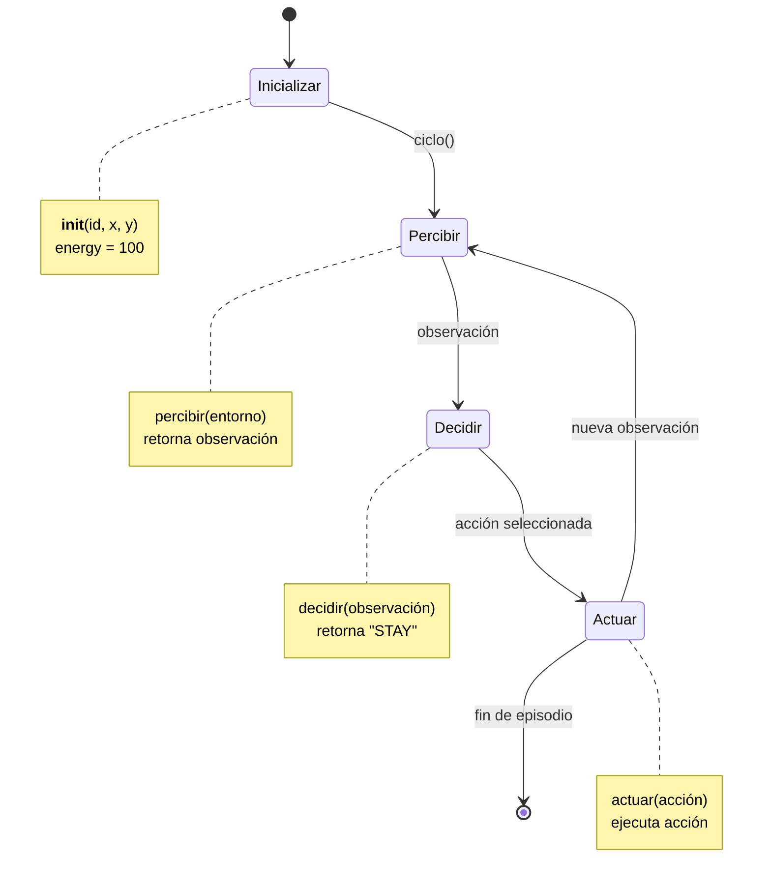
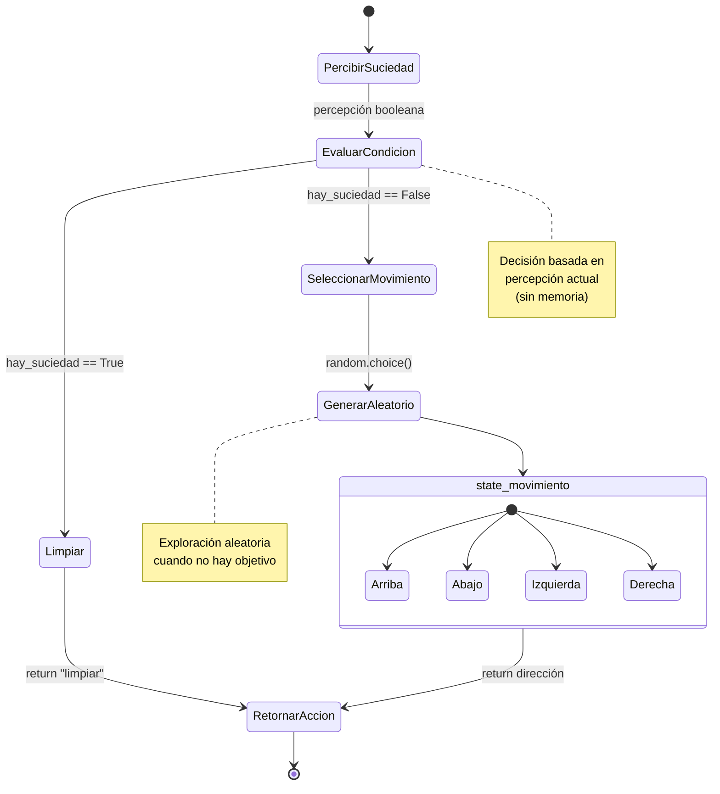
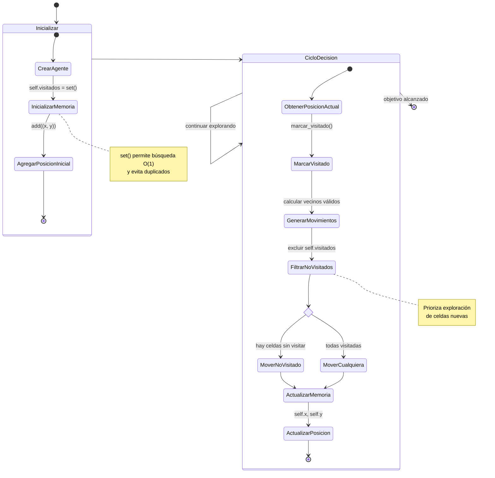
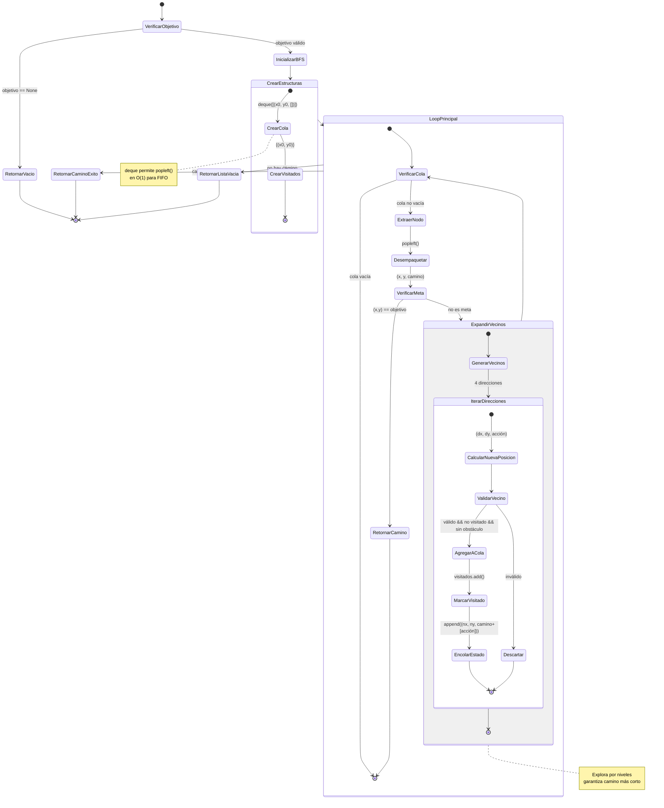
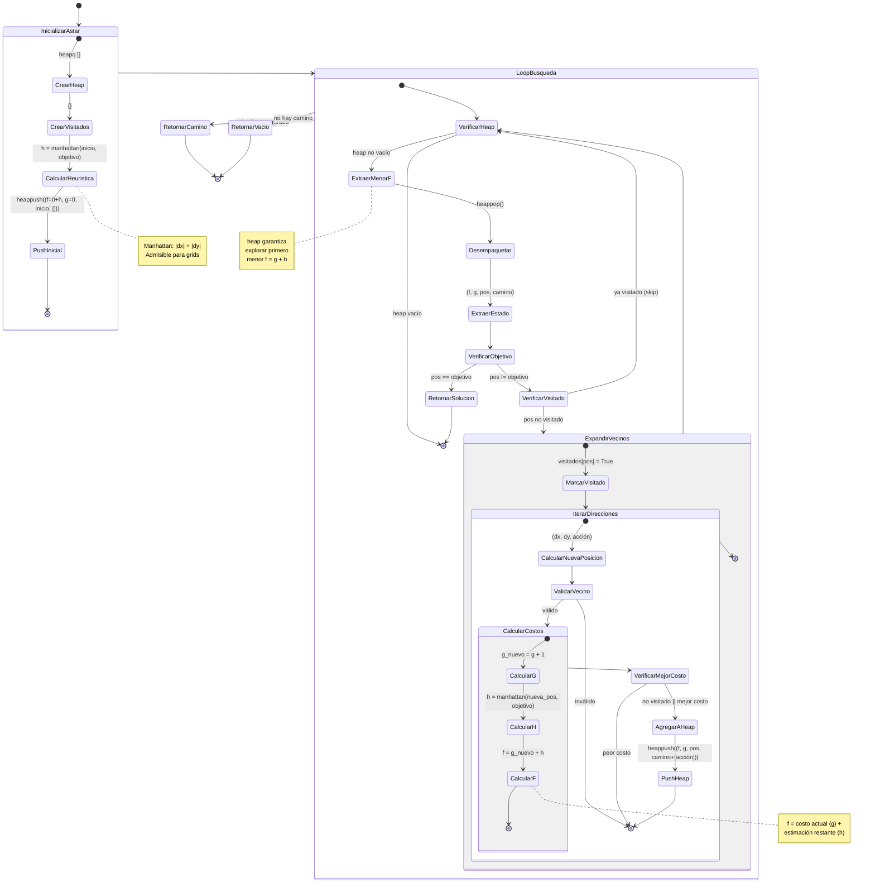
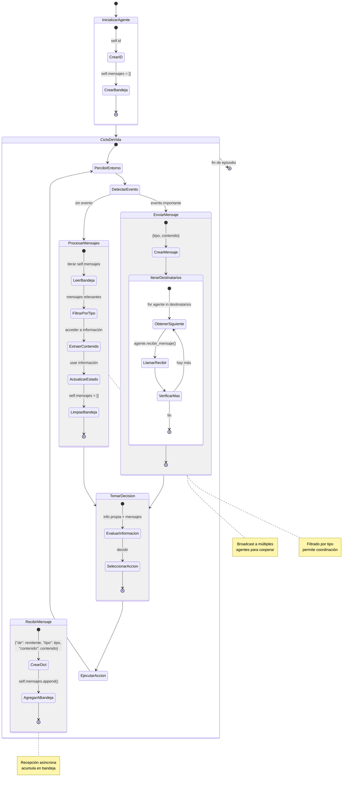
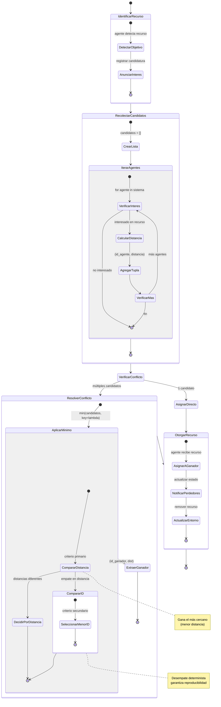
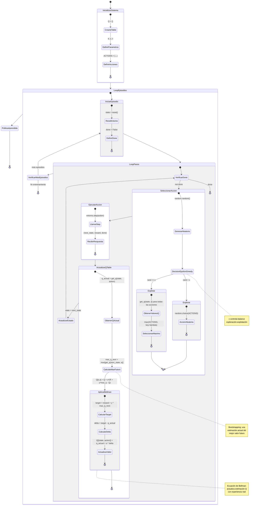
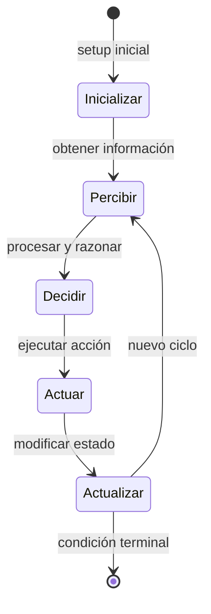

# Diagramas de Estados de los Tutoriales

Este archivo contiene los diagramas de estados en formato Mermaid para cada nivel de tutorial de la plataforma de agentes inteligentes.

---

## NIVEL 1: Fundamentos - Arquitectura de Agentes Inteligentes

### Diagrama del Ciclo Básico del Agente

### Descripción del Flujo
- **Inicializar**: El agente se crea con ID, posición (x,y) y energía inicial
- **Percibir**: Obtiene información del entorno (posición, energía, estado)
- **Decidir**: Aplica lógica de decisión (en nivel 1 retorna acción fija)
- **Actuar**: Ejecuta la acción seleccionada
- **Loop**: El ciclo se repite hasta que termine el episodio

---

## NIVEL 2: Agentes Reactivos - Arquitectura Estímulo-Respuesta

### Diagrama del Agente Limpiador Reactivo

### Descripción del Flujo
- **PercibirSuciedad**: Lee el estado booleano de la celda actual
- **EvaluarCondicion**: Punto de decisión basado en regla if/else
- **Limpiar**: Si detecta suciedad, ejecuta acción "limpiar"
- **SeleccionarMovimiento**: Si no hay suciedad, elige dirección aleatoria
- **RetornarAccion**: Devuelve la acción seleccionada al entorno

---

## NIVEL 3: Agentes con Estado Interno - Memoria y Exploración

### Diagrama del Agente con Memoria de Visitados

### Descripción del Flujo
- **Inicializar**: Crea el agente y el conjunto de visitados con posición inicial
- **MarcarVisitado**: Agrega la posición actual al set de visitados
- **GenerarMovimientos**: Calcula las 4 direcciones cardinales posibles
- **FiltrarNoVisitados**: Separa movimientos a celdas no visitadas
- **DecisionMovimiento**: Prioriza celdas nuevas, con fallback a cualquiera
- **ActualizarMemoria**: Registra la nueva posición en visitados

---

## NIVEL 4: Agentes Basados en Objetivos - Planificación con BFS

### Diagrama del Algoritmo BFS para Planificación

### Descripción del Flujo
- **InicializarBFS**: Crea cola FIFO con estado inicial y set de visitados
- **LoopPrincipal**: Mientras haya nodos por explorar
- **ExtraerNodo**: Toma el primer elemento de la cola (FIFO)
- **VerificarMeta**: Comprueba si llegó al objetivo
- **ExpandirVecinos**: Genera 4 vecinos (arriba, abajo, izquierda, derecha)
- **ValidarVecino**: Verifica límites, obstáculos y si no fue visitado
- **EncolarEstado**: Agrega vecino válido con camino acumulado
- **RetornarCamino**: Devuelve secuencia de acciones o lista vacía

---

## NIVEL 5: Búsqueda Informada - A* con Heurística Manhattan

### Diagrama del Algoritmo A* con Priorización

### Descripción del Flujo
- **InicializarAstar**: Crea heap vacío y calcula h inicial con Manhattan
- **ExtraerMenorF**: Toma el nodo con menor f del heap (prioridad)
- **VerificarObjetivo**: Si encontró la meta, retorna el camino
- **ExpandirVecinos**: Para cada vecino válido
- **CalcularCostos**: g_nuevo = g + costo_movimiento, h = Manhattan, f = g + h
- **VerificarMejorCosto**: Solo agrega si es nuevo o mejora costo previo
- **PushHeap**: Inserta vecino con prioridad f en el heap

---

## NIVEL 6: Sistemas Multi-Agente - Comunicación y Cooperación

### Diagrama de Comunicación entre Agentes

### Descripción del Flujo
- **InicializarAgente**: Crea ID único y bandeja de mensajes vacía
- **DetectarEvento**: Identifica información relevante para compartir
- **EnviarMensaje**: Itera sobre destinatarios llamando recibir_mensaje
- **RecibirMensaje**: Almacena mensaje estructurado en bandeja
- **ProcesarMensajes**: Filtra, extrae información y limpia bandeja
- **TomarDecision**: Integra percepción local con mensajes recibidos

---

## NIVEL 7: Competencia y Resolución de Conflictos

### Diagrama de Resolución de Conflictos por Recursos

### Descripción del Flujo
- **IdentificarRecurso**: Cada agente detecta y anuncia interés en recurso
- **RecolectarCandidatos**: Construye lista de tuplas (id_agente, distancia)
- **VerificarConflicto**: Determina si hay competencia (múltiples candidatos)
- **ResolverConflicto**: Aplica función min con key lambda
- **CompararDistancia**: Primer criterio: menor distancia gana
- **CompararID**: Criterio de desempate: menor ID gana (determinista)
- **OtorgarRecurso**: Asigna recurso al ganador y actualiza sistema

---

## NIVEL 8: Aprendizaje por Refuerzo - Q-Learning Básico

### Diagrama del Loop de Entrenamiento con Q-Learning

### Descripción del Flujo
- **InicializarSistema**: Crea Q-table vacía y define hiperparámetros
- **LoopEpisodios**: Itera sobre múltiples episodios de entrenamiento
- **SeleccionarAccion**: Implementa ε-greedy (explorar vs explotar)
- **Explorar**: Elige acción aleatoria con probabilidad ε
- **Explotar**: Elige acción con mayor Q(state, action)
- **EjecutarAccion**: Interactúa con entorno, recibe reward y next_state
- **ActualizarQTable**: Aplica ecuación de Bellman para actualizar Q
- **CalcularTarget**: target = reward + γ * max(Q(next_state, a'))
- **ActualizarValor**: Q(s,a) ← Q(s,a) + α * (target - Q(s,a))

---

## Resumen de Patrones Comunes

### Estados Transversales

### Niveles de Complejidad
1. **Nivel 1-2**: Ciclo simple sin estado (reactivo)
2. **Nivel 3**: Añade memoria interna (visitados)
3. **Nivel 4-5**: Planificación con búsqueda (BFS/A*)
4. **Nivel 6-7**: Interacción multi-agente (comunicación/competencia)
5. **Nivel 8**: Aprendizaje adaptativo (Q-Learning)

---

## Notas de Implementación

- **Estructuras de Datos Clave**: 
  - `set` para visitados (O(1) lookup)
  - `deque` para BFS (O(1) popleft)
  - `heapq` para A* (cola de prioridad)
  - `dict` para Q-table (almacenamiento disperso)

- **Patrones de Control**:
  - Reactivos: if/else simple
  - Con memoria: actualización de estado interno
  - Planificación: while loop hasta encontrar solución
  - Multi-agente: iteración sobre colección de agentes
  - RL: loop episodios × loop pasos

- **Optimizaciones**:
  - Validación temprana (early return)
  - Verificación de visitados antes de encolar
  - Limpieza de estructuras temporales
  - Epsilon decay en RL para convergencia
